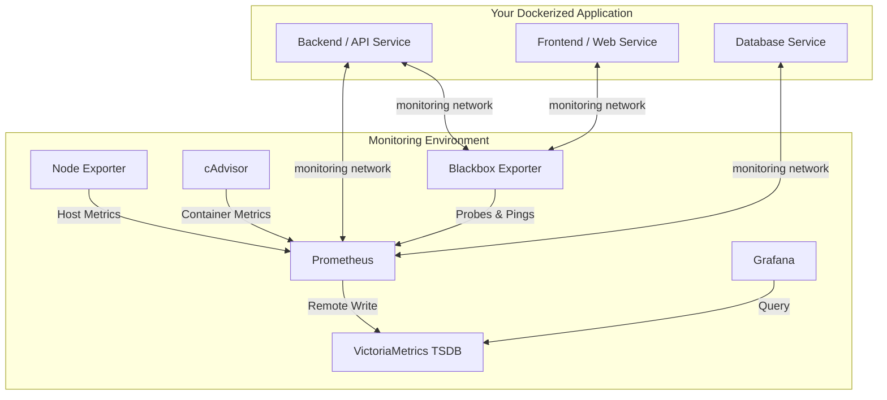

# Universal Docker Monitoring & Integration Environment

A portable, automated, and zero-configuration monitoring stack designed to run alongside and monitor **any** dockerized application. 

This repository provides a preconfigured, high-performance monitoring stack (Prometheus, VictoriaMetrics, Grafana, Node Exporter, cAdvisor, and Blackbox Exporter) along with a smart CLI tool (`cli.js`) to dynamically merge and connect your application services to the monitoring environment.

---

## Key Features

* **Zero-Touch Network Wiring**: Automatically creates a shared `monitoring` bridge network and attaches your target application services to it.
* **Smart Relative Path Rewriting**: You do not need to clone your application inside this repository. The CLI handles applications located **anywhere** on the host. It automatically rewrites relative paths (e.g., `build: ./src`, `volumes: - ./data:/app/data`, `env_file: .env`) to resolve correctly from the root monitoring directory.
* **Dual-Mode Configuration**: Supports an **Interactive Wizard** (ideal for local/manual setups) and an **Automated CLI** (ideal for CI/CD pipelines, cloud-init scripts, or Ansible/Terraform orchestration).
* **Multi-Layer Probing**:
  * **Application Probes (HTTP/TCP)**: Configures HTTP/TCP health checks via Blackbox Exporter.
  * **Host Checks (ICMP)**: Pings remote hosts, gateway IPs, or other cloud instances directly.
  * **Container Metrics**: Auto-discovers container resource usage via cAdvisor.
  * **Host Metrics**: Gathers system-level stats (CPU, Memory, Disk) via Node Exporter.
* **VictoriaMetrics TSDB Integration**: Leverages VictoriaMetrics as a remote-write destination for Prometheus, offering superior compression, performance, and lower memory footprint compared to native storage.
* **Wipe Clean Baseline**: Each configuration run resets the scrape configurations to a clean default state to prevent duplicate/stale targets, while keeping core metrics intact.

---

## Architecture Flow



---

## Quick Start Guide

### Step 1: Clone the Monitoring Environment
Clone this repository to your server or local machine:
```bash
git clone <this-repository-url> monitoring-environment
cd monitoring-environment
```

### Step 2: Run the CLI Integration Tool
You can integrate any external dockerized application by pointing the CLI tool to its `docker-compose.yml` file.

#### Option A: Interactive Setup Wizard (Manual)
Run the interactive helper:
```bash
npm run config
```
1. **App Path**: Enter the relative or absolute path to your application's `docker-compose.yml` (e.g., `../my-web-app/docker-compose.yml`).
2. **Service Integration**: Choose which services to attach to the monitoring network.
3. **Prometheus Metrics**: Select if the service exposes metrics (e.g. `/metrics` endpoint) and configure ports.
4. **Blackbox Probes**: Select if you want HTTP/TCP endpoint health pings and configure paths.
5. **Host Pings**: Enable Host Ping (ICMP) checks for your external servers or instance IPs (e.g. `192.168.1.1`).
6. **Spin Up**: Select `y` to automatically merge configurations and run `docker compose up -d`.

#### Option B: Automated / Scripted Setup (CI/CD / Cloud-init)
Run the script non-interactively using CLI flags:
```bash
node cli.js init \
  --app ../my-web-app/docker-compose.yml \
  --blackbox-app http://my-backend-service:5000/health,http://my-frontend-service:3000/ \
  --blackbox-host 192.168.1.1,10.0.0.12 \
  --start
```

---

## CLI Reference

### Commands

| Command | Usage | Description |
| :--- | :--- | :--- |
| `init` (default) | `node cli.js init [flags]` or `npm run config` | Performs path rewriting, merges docker-compose configurations, and sets up Prometheus targets. |
| `merge` | `node cli.js merge --app <path>` or `npm run merge -- --app <path>` | Merges application services, volumes, and networks without modifying Prometheus scrape configs. |
| `status` | `node cli.js status` or `npm run status` | Shows current configuration status, merged services, and configured scrape targets. |

### Arguments & Flags for `init`

* **`--app <path>`**: Path to your target application's `docker-compose.yml` (defaults to `../docker-compose.yml`).
* **`--blackbox-app <url1,url2>`**: Comma-separated list of application container endpoints to probe via HTTP/TCP.
* **`--blackbox-host <ip1,ip2>`**: Comma-separated list of host IP addresses or domain names to ping via ICMP.
* **`--start`**: Automatically spins up/restarts the combined Docker Compose stack.

---

## Verifying the Setup

Once the stack is running, you can access the following dashboards and target pages:

* **Prometheus Targets UI**: `http://localhost:9090/targets`
  * *Use this to inspect active metrics scraping and health checks status.*
* **Grafana Dashboard**: `http://localhost:3002`
  * *Grafana port mapping is mapped to `3002:3000` to prevent port collisions. Default login is admin/admin.*
* **VictoriaMetrics Data Endpoint**: `http://localhost:8428`
* **Node Exporter Metrics**: `http://localhost:9100/metrics`
* **cAdvisor Metrics**: `http://localhost:8080/metrics`
* **Blackbox Exporter UI**: `http://localhost:9115`

To inspect the status of the environment via the CLI, run:
```bash
npm run status
```

---

## Testing with the Decoupled Sample Application

A mock Hospital Management System (HMS) application is located in the sibling `mock-application` folder to test the environment. 

1. Run the configuration tool, specifying the sample application's compose path:
   ```bash
   node cli.js init --app ../mock-application/docker-compose.app.yml
   ```
2. Follow the interactive prompts to integrate the sample `backend`, `frontend`, and `postgres` database services.
3. Access the sample app frontend at `http://localhost:5173`.
